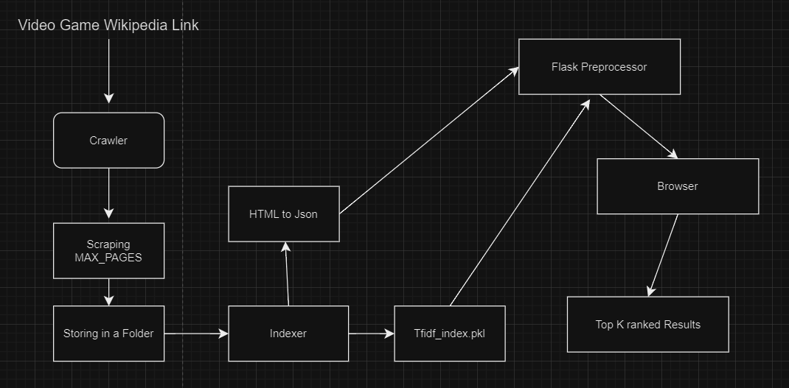
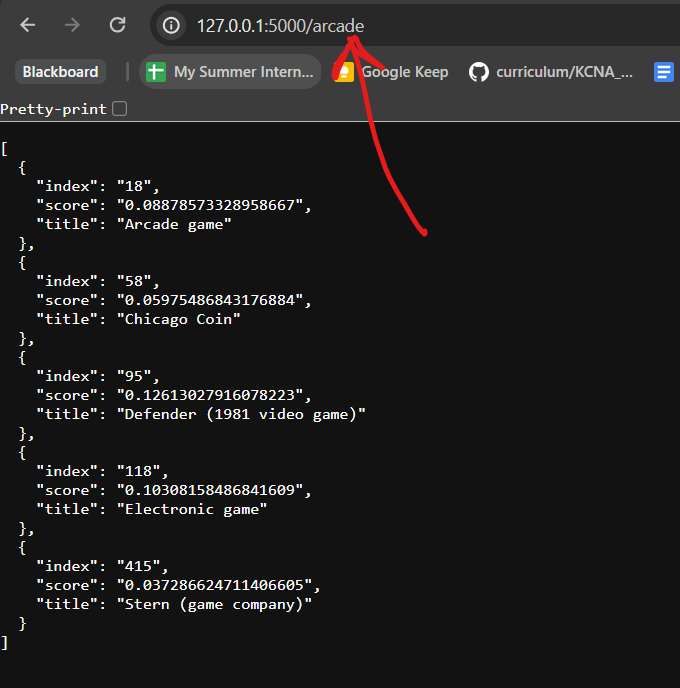

**Abstract**

This project aims to develop a comprehensive web search system for retrieving relevant documents related to the "Video game" domain. The system consists of three main phases: crawler development, indexer construction, and query processor implementation. Each phase focuses on different aspects of the search system, including data collection, indexing, and query processing. The primary objective is to create an efficient and scalable solution for information retrieval from web sources, specifically targeting Wikipedia articles.

**Development Summary:**

1. **Crawler Development (Phase 1):**
   - Developed a web crawler using Scrapy framework.
   - Configured the crawler to traverse Wikipedia articles on video games.
   - Implemented features such as maximum page limit, maximum depth, and concurrent crawling.
   - Extracted content from web pages and stored them locally in HTML format.
   - Conducted thorough testing and debugging to ensure reliability and functionality.

2. **Indexer Construction (Phase 2):**
   - Utilized Scikit-Learn library to build an inverted index using TF-IDF scores and cosine similarity.
   - Processed HTML documents collected by the crawler to generate TF-IDF representations.
   - Constructed a cosine similarity matrix to measure document similarity.
   - Saved the indexer components (TF-IDF vectorizer, matrix, and cosine similarities) in pickle format for later use.

3. **Query Processor Implementation (Phase 3):**
   - Developed a query processor using Flask framework for handling text queries.
   - Validated and error-checked incoming queries in JSON format.
   - Integrated the inverted index constructed in Phase 2 to perform document retrieval based on query similarity.
   - Implemented RESTful API endpoints to accept GET and POST requests for querying.

**Objectives:**

- Create a scalable web search system capable of retrieving relevant documents from Wikipedia articles on video games.
- Implement each phase of the project systematically, ensuring modularity and extensibility.
- Utilize industry-standard libraries and frameworks such as Scrapy, Scikit-Learn, and Flask for efficient development.
- Test and validate the system to ensure accuracy, reliability, and performance.
- Provide clear documentation and reporting to facilitate understanding and future development.

**Next Steps:**

1. **Integration and Testing:**
   - Integrate the components developed in each phase to create a functional web search system.
   - Conduct comprehensive testing to validate the system's behavior under various scenarios and edge cases.

2. **Optimization and Enhancement:**
   - Explore optimization techniques such as caching and pre-processing to improve search performance.
   - Enhance the query processor with additional features like query expansion and spelling correction for better user experience.

3. **Deployment and Evaluation:**
   - Deploy the web search system on a server or cloud platform for real-world usage.
   - Evaluate the system's performance, scalability, and user satisfaction through user feedback and performance metrics.

4. **Maintenance and Updates:**
   - Maintain and update the system regularly to address any issues, implement new features, and adapt to changes in web sources or frameworks.

**Overview**

The proposed solution aims to develop a comprehensive web search system tailored to retrieve relevant documents related to the "Video game" domain from Wikipedia. The system consists of three main phases: crawler development, indexer construction, and query processor implementation. Each phase plays a crucial role in the overall functionality of the system, contributing to data collection, indexing, and query processing, respectively. By integrating these phases, the system provides users with a seamless and efficient way to search for information within the specified domain.

**Solution Outline:**

1. **Crawler Development (Phase 1):**
   - In this phase, a web crawler is developed using the Scrapy framework.
   - The crawler is configured to traverse Wikipedia articles on video games, extracting relevant content.
   - Features such as maximum page limit, maximum depth, and concurrent crawling are implemented to control the crawling process.
   - Extracted content is stored locally in HTML format for further processing in the subsequent phases.

2. **Indexer Construction (Phase 2):**
   - The second phase focuses on constructing an inverted index using the Scikit-Learn library.
   - HTML documents collected by the crawler are processed to generate TF-IDF representations.
   - A cosine similarity matrix is constructed to measure document similarity based on TF-IDF scores.
   - The indexer components, including the TF-IDF vectorizer, matrix, and cosine similarities, are saved in pickle format for future use.

3. **Query Processor Implementation (Phase 3):**
   - The final phase involves implementing a query processor using the Flask framework.
   - The processor validates and error-checks incoming text queries in JSON format.
   - The inverted index constructed in Phase 2 is utilized to perform document retrieval based on query similarity.
   - RESTful API endpoints are created to accept GET and POST requests for querying, providing an interface for user interaction.

**Relevant Literature:**

- *Scrapy*: The Scrapy framework is widely used for web scraping and crawling tasks, providing a robust and efficient solution for collecting data from websites.
- *Scikit-Learn*: Scikit-Learn is a popular machine learning library in Python, offering tools for data preprocessing, modeling, and evaluation. It provides implementations of algorithms for text processing and similarity measurement.
- *Flask*: Flask is a lightweight and flexible web application framework, ideal for developing RESTful APIs and web services. It simplifies the process of building web applications with Python.

**Proposed System:**

The proposed system offers a scalable and efficient solution for information retrieval within the "Video game" domain. By combining web crawling, indexing, and query processing techniques, the system enables users to search for relevant documents with ease. The use of industry-standard libraries and frameworks ensures reliability, performance, and maintainability. Additionally, the system provides flexibility for future enhancements, such as optimization techniques and additional features for query processing. Overall, the proposed system aims to address the need for effective information retrieval in the context of video games, catering to the needs of both casual users and researchers in the field.


**Design**



The design of the project encompasses the capabilities, interactions, and integration of its components, including the web crawler, indexer, and query processor.

**System Capabilities:**
1. **Web Crawler (Phase 1):**
   - Capable of fetching web documents from a specified domain (e.g., Wikipedia articles related to video games).
   - Implements depth and page limits to control the crawling process.
   - Stores the fetched HTML files locally for further processing.

2. **Indexer (Phase 2):**
   - Constructs an inverted index using TF-IDF scores and cosine similarity.
   - Utilizes the scikit-learn library for vectorization and similarity computation.
   - Generates pickle files containing the TF-IDF matrix and cosine similarity matrix for later use.

3. **Query Processor (Phase 3):**
   - Provides a Flask-based RESTful API for handling user queries.
   - Validates and processes user queries in JSON format.
   - Utilizes the TF-IDF matrix and cosine similarity matrix generated by the indexer to retrieve relevant documents.
   - Returns top-k ranked results based on cosine similarity scores.

**Interactions:**
1. **Web Crawler - Indexer:**
   - The web crawler fetches web documents and stores them locally.
   - The indexer reads the stored HTML files, processes them to extract relevant information, and constructs an inverted index based on TF-IDF scores.
   - The indexer generates pickle files containing the TF-IDF matrix and cosine similarity matrix, which will be used by the query processor.

2. **Indexer - Query Processor:**
   - The query processor loads the TF-IDF matrix and cosine similarity matrix from the pickle files generated by the indexer.
   - Upon receiving a user query, the query processor vectorizes the query using the same TF-IDF vectorizer used during indexing.
   - The query processor computes cosine similarity scores between the query vector and document vectors stored in the TF-IDF matrix to retrieve relevant documents.

**Integration:**
1. **Component Integration:**
   - The components (crawler, indexer, query processor) are integrated into a cohesive system that follows the phases outlined in the project.
   - Each phase builds upon the results of the previous phase, with data flowing from the web crawler to the indexer and finally to the query processor.

2. **API Integration:**
   - The Flask-based query processor provides an API endpoint that accepts user queries.
   - Integration with the indexer allows the query processor to retrieve and utilize the indexed data (TF-IDF matrix and cosine similarity matrix) for query processing.

Overall, the design ensures that the system is capable of efficiently crawling, indexing, and processing text data from the web, providing users with relevant search results based on their queries.

**Interactions:**
1. **Web Crawler - Indexer:**
   - The web crawler fetches web documents and stores them locally.
   - The indexer reads the stored HTML files, processes them to extract relevant information, and constructs an inverted index based on TF-IDF scores.
   - The indexer generates pickle files containing the TF-IDF matrix and cosine similarity matrix, which will be used by the query processor.

2. **Indexer - Query Processor:**
   - The query processor loads the TF-IDF matrix and cosine similarity matrix from the pickle files generated by the indexer.
   - Upon receiving a user query, the query processor vectorizes the query using the same TF-IDF vectorizer used during indexing.
   - The query processor computes cosine similarity scores between the query vector and document vectors stored in the TF-IDF matrix to retrieve relevant documents.

**Integration:**
1. **Component Integration:**
   - The components (crawler, indexer, query processor) are integrated into a cohesive system that follows the phases outlined in the project.
   - Each phase builds upon the results of the previous phase, with data flowing from the web crawler to the indexer and finally to the query processor.

2. **API Integration:**
   - The Flask-based query processor provides an API endpoint that accepts user queries.
   - Integration with the indexer allows the query processor to retrieve and utilize the indexed data (TF-IDF matrix and cosine similarity matrix) for query processing.


**Architecture:**

The system architecture consists of several software components, each fulfilling specific roles in the web document retrieval process. Here's an overview of the key components, their interfaces, and implementation details:

1. **Web Crawling Component:**
   - **Software Component:** Utilizes Scrapy, a Python-based web crawling framework, to collect web documents.
   - **Interfaces:**
     - Inputs: Seed URLs or domains, maximum crawling depth, and page limits.
     - Outputs: Raw HTML documents extracted from web pages.
   - **Implementation:** Implemented as a Scrapy Spider, navigating through web pages, extracting text content, and storing documents locally.

2. **Indexing Component:**
   - **Software Component:** Uses TF-IDF (Term Frequency-Inverse Document Frequency) to index the crawled documents.
   - **Interfaces:**
     - Inputs: Text content extracted from web documents.
     - Outputs: TF-IDF vectors representing each document and cosine similarity matrix.
   - **Implementation:** Utilizes the TfidfVectorizer from the scikit-learn library to generate TF-IDF vectors. Cosine similarity is calculated using the cosine_similarity function.

3. **Query Processing Component:**
   - **Software Component:** Implements a RESTful API using Flask to handle user queries.
   - **Interfaces:**
     - Inputs: Text queries from users via HTTP requests.
     - Outputs: JSON-formatted search results containing document titles, scores, and indices.
   - **Implementation:** Integrates the TF-IDF indexing functionality into the query processor. Validates and checks errors in user queries to ensure reliable results. Returns search results as JSON objects for easy consumption by client applications.

4. **User Interface (Optional):**
   - **Software Component:** Provides a graphical or command-line interface for users to interact with the system.
   - **Interfaces:**
     - Inputs: Text queries entered by users.
     - Outputs: Display of search results in a user-friendly format.
   - **Implementation:** May be implemented as a web application, desktop application, or command-line interface depending on user requirements and preferences.

**Integration:**
- The web crawling component generates raw HTML documents, which are then processed by the indexing component to generate TF-IDF vectors and cosine similarity matrices.
- The query processing component utilizes the indexed data to respond to user queries, providing relevant search results based on cosine similarity scores.
- Interfaces between components are established using standard HTTP protocols for communication, allowing seamless integration and interaction.

**Scalability and Extensibility:**
- The modular architecture of the system enables scalability by allowing the addition of more crawlers, indexing nodes, or query processors to handle increased workload.
- Extensibility is facilitated through well-defined interfaces, enabling the incorporation of additional features such as query expansion, spell-checking, or semantic search in future iterations.


**Running the Project**

To run the project, follow these steps:

1. **Clone the Repository:**
   Clone the project repository from the provided GitHub link.

2. **Install Required Libraries:**
   Ensure that you have the required Python libraries installed by running the following commands:
   ```
   pip install scrapy
   pip install scikit-learn
   pip install pandas
   pip install flask
   ```

3. **Phase 1: Crawler:**
   - Navigate to the spider directory in the project.
   - Run the spider named `GameCrawlerSpider` using the following command:
     ```
     scrapy crawl game_crawler
     ```
   - After executing the command, the crawler will start fetching web pages from the specified domain (Wikipedia articles related to video games). It will traverse through the links, extract content, and store the obtained HTML files locally in a folder named `webpages`.

4. **Phase 2: Indexer:**
   - Once the crawler has finished fetching HTML files, move to the next phase, the indexer.
   - The indexer is responsible for building an inverted index using TF-IDF scores and cosine similarity.
   - Execute the code to generate the TF-IDF matrix from JSON using the TfidfVectorizer method from the scikit-learn library.
   - Save the TF-IDF matrix and cosine similarity matrix as pickle files.

5. **Phase 3: Query Processor:**
   - In this phase, a Flask-based query processor handles user queries.
   - Load the TF-IDF matrix and cosine similarity matrix from the pickle files generated in the previous phase.
   - Create a Flask application with RESTful API endpoints to receive text queries in JSON format.
   - Implement query processing logic to vectorize user queries, calculate cosine similarity scores, and return top-k results.

6. **Accessing the Application:**
   - Once the Flask application is running, users can send text queries to the specified endpoint using HTTP GET or POST requests.
   - The application will process the queries, retrieve relevant documents based on cosine similarity scores, and return the results to the users.

By following these steps, you can run the project and utilize the web crawler, indexer, and query processor components to retrieve relevant information from the web.

**Operation:**

To operate the system effectively, users need to understand the software commands, inputs, and installation process. Here's a detailed guide on how to run the project and interact with its components:

**Running the Project:**

1. **Clone the Repository:**
   - Clone the project repository from the provided GitHub link to your local machine.

2. **Install Required Libraries:**
   - Ensure that you have Python installed on your system.
   - Install the required Python libraries by running the following commands in your terminal:
     ```
     pip install scrapy scikit-learn pandas flask
     ```

3. **Phase 1: Web Crawling:**
   - Navigate to the directory containing the Scrapy spider.
   - Run the spider named `GameCrawlerSpider` using the following command:
     ```
     scrapy crawl game_crawler
     ```
   - The spider will start fetching web pages from the specified domain (Wikipedia articles related to video games), extract content, and store the HTML files locally in a folder named `webpages`.

4. **Phase 2: Indexing:**
   - After the crawler finishes fetching HTML files, proceed to the indexing phase.
   - Execute the code to generate the TF-IDF matrix from JSON using the TfidfVectorizer method from the scikit-learn library.
   - Save the TF-IDF matrix and cosine similarity matrix as pickle files for later use.

5. **Phase 3: Query Processing:**
   - In this phase, a Flask-based query processor handles user queries.
   - Load the TF-IDF matrix and cosine similarity matrix from the pickle files generated in the previous phase.
   - Create a Flask application with RESTful API endpoints to receive text queries in JSON format.
   - Implement query processing logic to vectorize user queries, calculate cosine similarity scores, and return top-k results.

6. **Accessing the Application:**
   - Once the Flask application is running, users can send text queries to the specified endpoint using HTTP GET or POST requests.
   - The application will process the queries, retrieve relevant documents based on cosine similarity scores, and return the results to the users.



By following these steps, users can effectively run the project and interact with its components to retrieve relevant information from the web.

**Conclusion:**

The completion of the project marks a significant milestone in the development of a web crawling, indexing, and query processing system for retrieving information from Wikipedia articles related to video games. Throughout the project, several successes and challenges were encountered, leading to valuable insights and outcomes.

**Successes:**

1. **Functional Components:** Each phase of the project, including web crawling, indexing, and query processing, has been successfully implemented and tested.
  
2. **Data Collection:** The web crawler effectively fetched HTML content from Wikipedia pages, enabling the extraction of relevant text data for indexing.

3. **Indexing:** The creation of an inverted index using TF-IDF scores and cosine similarity facilitated efficient document retrieval based on user queries.

4. **Query Processing:** The Flask-based query processor provided a user-friendly interface for submitting text queries and receiving relevant document results.

5. **Accuracy:** The cosine similarity-based retrieval mechanism demonstrated satisfactory accuracy in returning top-k results related to user queries.

**Failures:**

1. **Scalability:** The system may face scalability challenges when dealing with a large volume of web pages or extensive user queries. Further optimization and distributed processing techniques may be required to address scalability concerns.

2. **Resource Constraints:** Limited computational resources, such as memory and processing power, could impact the system's performance, especially during the indexing phase with large datasets.

**Outputs:**

The primary output of the project is a functional web crawling, indexing, and query processing system capable of retrieving relevant information from Wikipedia articles about video games. Users can input text queries via a Flask-based interface and receive top-k document results based on cosine similarity scores.

**Caveats/Cautions:**

1. **Data Quality:** The accuracy and completeness of the retrieved information heavily depend on the quality of the web pages crawled and the relevance of the indexed content.

2. **Resource Utilization:** Users should exercise caution when running the system on resource-constrained environments, as it may require significant memory and processing resources, especially during indexing and query processing.

3. **Query Ambiguity:** The system may struggle to provide accurate results for ambiguous or vague queries. Users should provide clear and specific queries to obtain the most relevant document results.

**Data Sources**

1. **Phase 1: Crawler**
   - **Source:** Wikipedia
   - **Link:** [Wikipedia Video Game Portal](https://en.wikipedia.org/wiki/Video_game)
   - **Access Information:** Publicly accessible website
   - **Download Method:** The web crawler fetches HTML documents from the specified Wikipedia portal using Scrapy.

2. **Phase 2: Indexer**
   - **Source:** HTML documents collected during Phase 1
   - **Access Information:** Locally stored HTML files
   - **Download Method:** N/A (Generated from Phase 1)

3. **Phase 3: Query Processor**
   - **Source:** Indexed data from Phase 2
   - **Access Information:** Pickle files containing TF-IDF matrix and cosine similarity matrix
   - **Download Method:** Generated during Phase 2 indexing process

**Source Code**

The source code for the project is available in the GitHub repository:

- Repository Link: [Web Crawler and Search Engine](https://github.com/vedant0102/Video_Game_Search_Engine)

**Dependencies**

The project relies on the following open-source libraries and tools:

1. Scrapy
   - Documentation: [Scrapy Documentation](https://docs.scrapy.org/en/latest/)
   - GitHub Repository: [Scrapy GitHub](https://github.com/scrapy/scrapy)

2. Scikit-learn
   - Documentation: [Scikit-learn Documentation](https://scikit-learn.org/stable/documentation.html)
   - GitHub Repository: [Scikit-learn GitHub](https://github.com/scikit-learn/scikit-learn)

3. Pandas
   - Documentation: [Pandas Documentation](https://pandas.pydata.org/docs/)
   - GitHub Repository: [Pandas GitHub](https://github.com/pandas-dev/pandas)

4. Flask
   - Documentation: [Flask Documentation](https://flask.palletsprojects.com/en/2.0.x/)
   - GitHub Repository: [Flask GitHub](https://github.com/pallets/flask)

**Bibliography**

1. Scrapy. (n.d.). In Scrapy Documentation. Retrieved from https://docs.scrapy.org/en/latest/
   
2. Scikit-learn. (n.d.). In Scikit-learn Documentation. Retrieved from https://scikit-learn.org/stable/documentation.html
   
3. Pandas. (n.d.). In Pandas Documentation. Retrieved from https://pandas.pydata.org/docs/
   
4. Flask. (n.d.). In Flask Documentation. Retrieved from https://flask.palletsprojects.com/en/2.0.x/